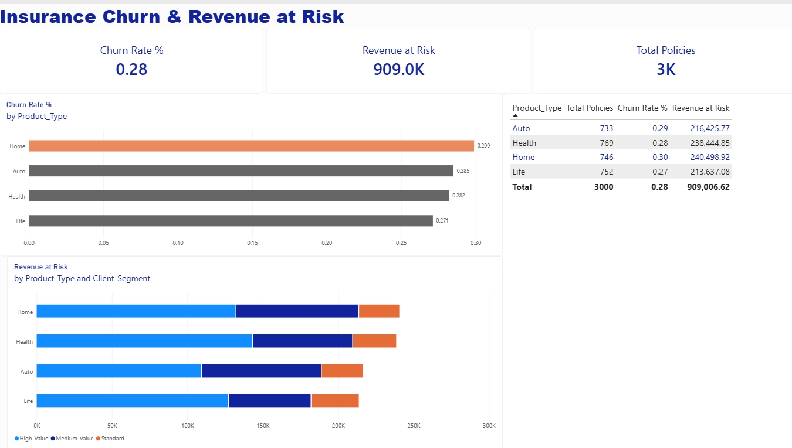
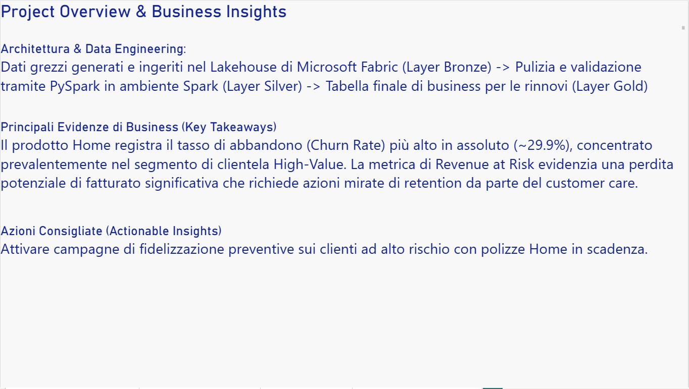
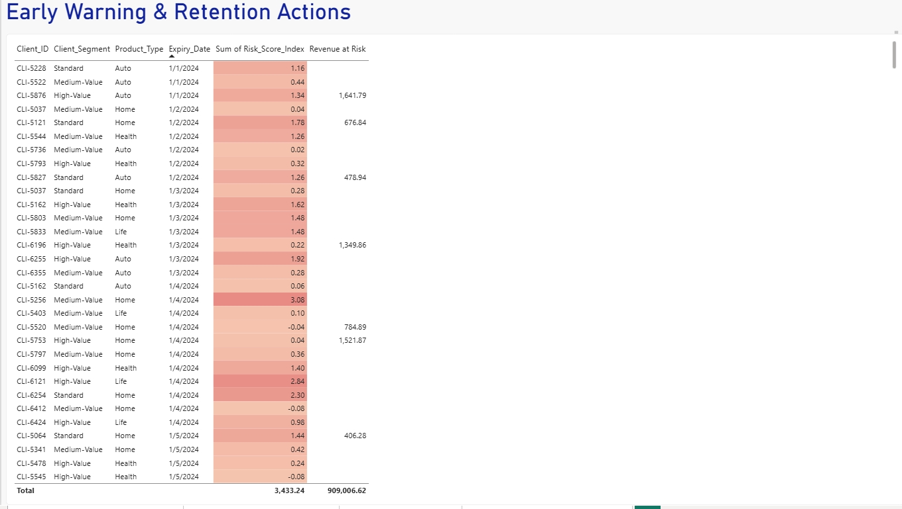
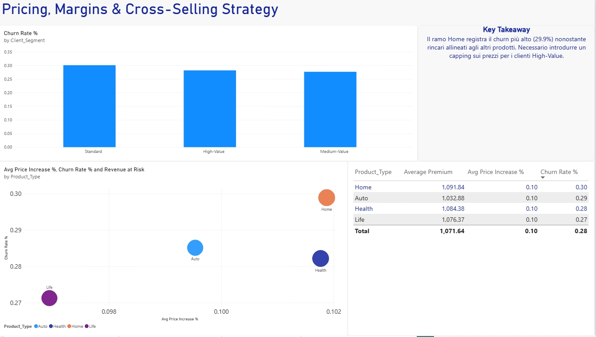

# insurance-churn-analytics
End-to-end data analytics and engineering project on insurance churn risk using Microsoft Fabric and Power BI.
# 📊 Insurance Churn & Revenue Risk Analytics

## 🎯 Panoramica del Progetto
Questo progetto end-to-end affronta l'analisi predittiva e di rischio per un portafoglio di polizze assicurative, con l'obiettivo di trasformare i dati grezzi in leve strategiche per il Customer Care e la retention proattiva.

---

## 🏗️ Architettura Dati & Tech Stack
L'intera pipeline è stata sviluppata sfruttando le potenzialità moderne di **Microsoft Fabric**:
- **Layer Bronze (Ingestione):** Acquisizione dei dati grezzi generati e centralizzati nel Lakehouse.
- **Layer Silver (Trasformazione & Validazione):** Pulizia, controllo qualità e strutturazione tramite notebook **PySpark** in ambiente Spark.
- **Layer Gold (Business Modeling):** Definizione delle tabelle finali ottimizzate per il business, con modelli semantici pronti per la reportistica.
- **Business Intelligence:** **Microsoft Power BI** per la visualizzazione interattiva dei KPI di rischio.
- **Competenze chiave:** Statistica attuariale, Data Engineering, DAX, Risk Management.

---

## 📈 Principali Evidenze di Business (Key Takeaways)
- **Tasso di Abbandono (Churn Rate):** Il ramo **Home** registra il tasso di churn più alto in assoluto (~29.9%), concentrato prevalentemente nel segmento di clientela a valore elevato (*High-Value*).
- **Revenue at Risk:** La metrica evidenzia una potenziale perdita di fatturato significativa che richiede azioni di fidelizzazione mirate.
- **Politiche di Prezzo:** È emersa la necessità di introdurre un capping sui rincari dei premi per evitare che politiche commerciali troppo aggressive spingano i clienti più redditizi verso la concorrenza.

---

## 🛠️ Azioni e Leve Strategiche
- **Customer Care & Early Warning:** Passaggio da un approccio reattivo a una retention proattiva basata sull'indice di rischio e sulle scadenze imminenti.
- **Pricing & Margins:** Ottimizzazione delle strategie di cross-selling e protezione dei margini sui segmenti chiave.

---

## 🖼️ Anteprima delle Dashboard
*(Qui sotto puoi inserire gli screenshot delle tue pagine Power BI)*

